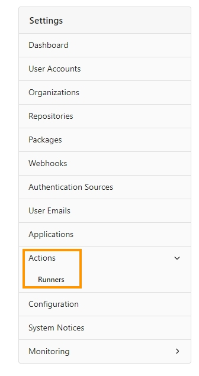
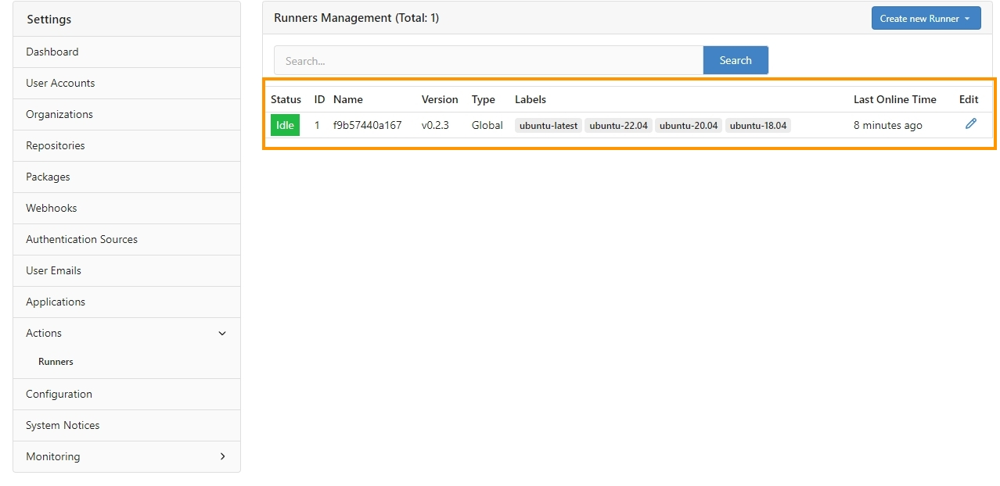
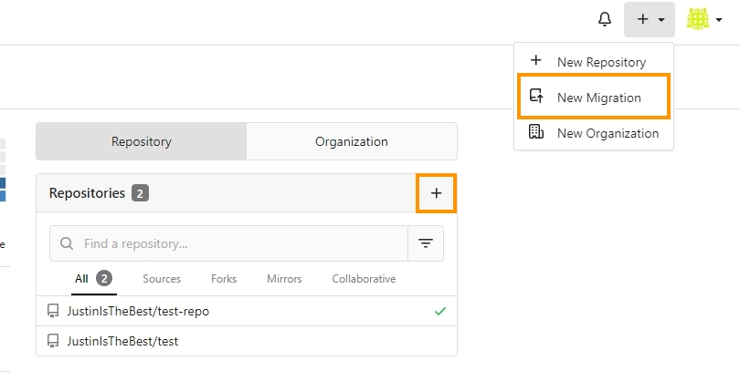
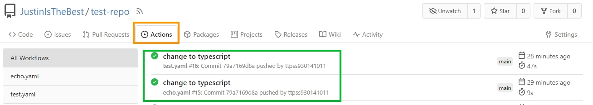
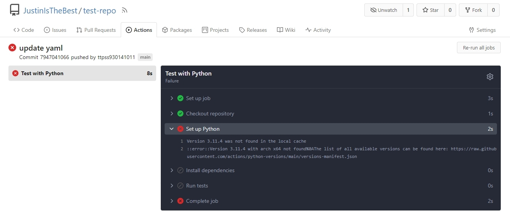

<div align="center">
<h1 align="center">

<br>
  Gitea-workshop
</h1>
<h3>◦ Workshop on open-source codebase management platform <a href="https://about.gitea.com/">Gitea</a>.</h3>
<hr/>

<p align="center">


</p>

English Readme | <a href="./README.tw.md">繁體中文 Readme</a>

</div>

## **Resources**

### **Introduction**

[Cloud summit 2023 open source Gitea launches Actions to integrate CI/CD process](https://cloudsummit.ithome.com.tw/2023/lab-page/2225)

### **Gitea Docs**

[Gitea documentation](https://docs.gitea.com/)

### **Steps**

[Git Workshop repo](https://github.com/go-training/gitea-workshop)

## **Foreword**

This workshop at Cloud Summit 2023 was undoubtedly the most valuable one for me. Appleboy demonstrated his exceptional expertise and, alongside four other talented international developers, they created Gitea, an open-source platform similar to Github with a mission to surpass and become the next biggest codebase management platform. Their achievement is truly impressive.

During the workshop, Appleboy highlighted MediaTek's strong emphasis on security in the workplace, where some areas even lack internet access. Under such circumstances, setting up a self-hosted Git service can be quite troublesome. GitLab, though powerful, consumes significant resources when self-hosted. This led to the birth of Gitea, a project written in Golang, compiled into an executable file that can be executed cross-platform with minimal resource requirements. Deploying Gitea on an idle VM enables the entire company to enjoy Git services effortlessly. It's truly remarkable.

This project integrates all the materials covered in the workshop, from the initial setup of Gitea service, configuring Runners, to finally uploading a test repository and setting up Gitea actions, all done using Docker. Following the workshop allows participants to fully experience the power of Golang and witness the capabilities of Appleboy and the other developers. It's truly impressive.

## **Getting started**

### **Installation**

Clone repo

```docker
git clone https://github.com/ttpss930141011/Gitea-workshop.git
```

Start the Gitea service

```docker
cd gitea
docker-compose up -d
```

### **Install Gitea Actions**

After following the steps in the Workshop, you can see that the Runner tab appears.



### **Install runner**

Follow the steps in the Workshop, or refer to the gitea-runner-1 folder in this repo and add a .env file

```makefile
// ./gitea-runner-1/.env
GITEA_INSTANCE_URL=<gitea service instance url>
GITEA_RUNNER_REGISTRATION_TOKEN=<runners registration token>
```

Start him:

```docker
docker-compose up -d
```

After startup, you can see the newly created Runner in Runners Management



References: [https://docs.gitea.com/zh-cn/usage/actions/quickstart](https://docs.gitea.com/zh-cn/usage/actions/quickstart)

### **Initialize the repo on Gitea**

In fact, the interface is basically very similar to the tools we usually use, and there are even repos that can migrate other Codebase platforms.



After building the project, we need to open the Gitea Actions function of Repo itself, which can be set in Repo setting.

Please refer to the documentation [https://docs.gitea.com/usage/actions/quickstart#use-actions](https://docs.gitea.com/usage/actions/quickstart#use-actions)

In the QA page, it is also mentioned that the Actions of the new warehouse can be enabled by default, [hyperlink](https://docs.gitea.com/usage/actions/faq#is-it-possible-to-enable-actions-for-new-repositories-by-default-for-my-own-instance).

### **Push your repo**

You can use the test-repo in this repo to push up to test whether CI will proceed.



#### **Note**

At the beginning, I pushed the Python project and used pytest for testing, but encountered an error of Version 3.11.4 was not found in the local cache as shown in the figure.



Obviously the installed Python version and runner os conform to the regulations in [versions-manifest.json](https://raw.githubusercontent.com/actions/python-versions/main/versions-manifest.json), but both will be in the Set Up Python made an error, and after crawling through the text, someone recently proposed a similar [Bug](https://github.com/actions/setup-python/issues/585), this issue has not been resolved, so use TypeScript instead and Use jest for testing.
