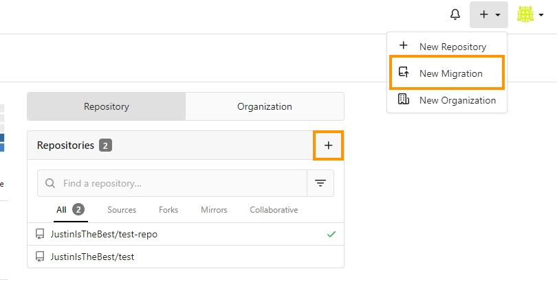
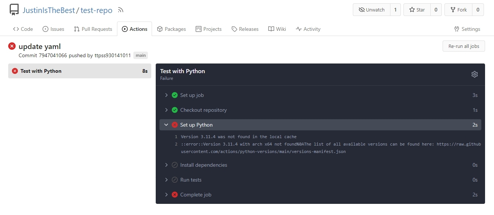

<div align="center">
<h1 align="center">

<br>
 Gitea-workshop
</h1>
<h3>◦ 一個強大開源 codebase 管理平台 — <a href="https://about.gitea.com/">Gitea</a> 的 Workshop</h3>
<hr/>

<p align="center">


</p>


<a href="./README.md">English Readme</a> | 繁體中文 Readme

</div>

## **Resources**

### **Introduction**

[Cloud summit 2023 開源 Gitea 推出 Actions 整合 CI/CD 流程](https://cloudsummit.ithome.com.tw/2023/lab-page/2225)

### **Gitea Docs**
[Gitea documentation](https://docs.gitea.com/)

### **Steps**

[Git Workshop repo](https://github.com/go-training/gitea-workshop)

## **Foreword**

這個 workshop 是在 Cloud summit 2023 上對我來說最有價值的一堂 Workshop，Appleboy 大實力堅強，與其他四位國外開發者在業餘時間開發 Gitea，建造一個開源的類 Github，誓言要取代且變成下一個它，十分厲害。

在這次 Workshop 上他介紹到，聯發科是一個很注重安全的職場環境，有些地方甚至連 Internet 都沒有，這個時候自架 Git 服務變成一個很麻煩的事情，如果用 Gitlab 就會知道自架 Gitlab service 是一個很肥很耗資源的東西，於是就誕生了 Gitea 這個專案，Gitea 使用 Golang 撰寫，編譯後的檔案為執行檔，可以跨平台執行，所需資源又十分小，只要一台沒人用的 VM 上開啟 Gitea service 就可以為全公司開啟 Git 服務，十分厲害。

這個專案整合了所有做完 Workshop 的材料，從一開始 Gitea 服務的建設，Runner 的建設，到最後上傳一個測試 Repo 並做好 Gitea actions，並且都使用 Docker，跟著做完會完全體驗到 Golang 的強大，還有 ~~Appleboy 與其他開發者的強大~~，十分厲害。


## **Getting started**

### **Installation**

Clone repo

```docker
git clone https://github.com/ttpss930141011/Gitea-workshop.git
```

啟動 Gitea 服務

```docker
cd gitea
docker-compose up -d
```

### **Install Gitea Actions**

跟著 Workshop 中的步驟走以後，可以看到 Runner tab 出現了。


### **Install runner**

跟著 Workshop 中的步驟走，或是參考此 repo 內的 gitea-runner-1 資料夾並新增 .env 檔

```makefile
// ./gitea-runner-1/.env
GITEA_INSTANCE_URL=<gitea service instance url>
GITEA_RUNNER_REGISTRATION_TOKEN=<runners registration token>
```

啟動他：

```docker
docker-compose up -d
```

啟動後就可以在 Runners Management 內看到剛建立的 Runner


參考資料：[https://docs.gitea.com/zh-cn/usage/actions/quickstart](https://docs.gitea.com/zh-cn/usage/actions/quickstart)

### **Initialize the repo on Gitea**

其實介面基本上與我們平常使用的工具十分相似，甚至也有可以 Migrate 其他 Codebase 平台的 repo。



在建好專案之後我們要去打開 Repo 本身的 Gitea Actions 功能，在 Repo setting 內可以設定。

請參考文檔 [https://docs.gitea.com/usage/actions/quickstart#use-actions](https://docs.gitea.com/usage/actions/quickstart#use-actions)

在問答內也有提到可以默認啟用新倉庫的 Actions 的方法，[超連結](https://docs.gitea.com/usage/actions/faq#is-it-possible-to-enable-actions-for-new-repositories-by-default-for-my-own-instance)。

### **Push your repo**

可以使用此 repo 內的 test-repo 推上去測試是否 CI 會進行。


#### **小坑**

一開始是推 Python 專案且使用 pytest 做測試，但遇到 Version 3.11.4 was not found in the local cache 錯誤如圖。



明明安裝的 Python version 與 runner os 都符合 [versions-manifest.json](https://raw.githubusercontent.com/actions/python-versions/main/versions-manifest.json) 內的規定，但都會在 Set up Python 出錯，之後爬文到近日有人也提出類似的 [Bug](https://github.com/actions/setup-python/issues/585)，此 issue 也尚未被解決，所以改為使用 TypeScript 並使用 jest 做測試。